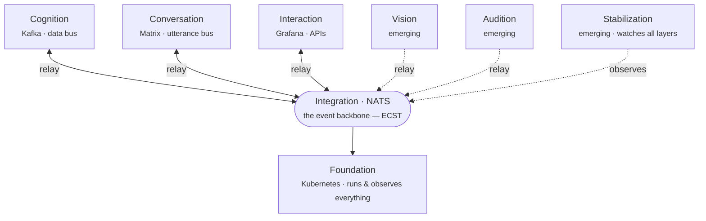

# Architecture

Plasma's architecture is organized into **eight specialized layers** — five in production today, three emerging (see the note below). Each has a dedicated purpose and its own message bus, and communicates through explicit relays — behavior emerges from channel topology, not a central coordinator.

Every layer relays through **Integration** (the NATS event backbone), and every layer runs on **Foundation**. Solid arrows are in production; dotted are emerging.

| | Layer | Purpose | Representative tech |
|---|---|---|---|
| **Fd** | **Foundation** | Infrastructure and observability — public cloud, private cloud, on-prem, air-gapped | Kubernetes, etcd, Ceph, Flannel |
| **In** | **Integration** | Central hub for all business data exchange | NATS, APIs, serverless |
| **Cg** | **Cognition** | AI/ML, analytics, real-time intelligence processing | Spark, Druid, Trino, Kafka |
| **Cv** | **Conversation** | Natural language processing, chatbots, AI interactions | DeepSeek, Llama, Matrix |
| **Vi** | **Vision** | Computer vision, image recognition, visual perception | — |
| **Au** | **Audition** | Audio processing, speech recognition, acoustic perception | — |
| **Ia** | **Interaction** | Dashboards, visualization, monitoring, external communication | Grafana, Graylog, Prometheus |
| **St** | **Stabilization** | System health monitoring and performance optimization across all layers | — |

!!! note "What's established today"
    Five layers are in production today — **Foundation, Integration, Cognition, Conversation, Interaction**. **Vision**, **Audition**, and **Stabilization** are emerging: they extend the same model (their own bus, relays in and out) but aren't built yet.

    **Stabilization** in particular is a planned **homeostasis** layer — a stabilization agent watching system health and triggering skills to react: either *notify a human* or *apply a policy automatically* to nudge the system back toward a balanced state. The model is defined; the agent isn't implemented yet.

## How the layers relate

- **Foundation** provisions and runs everything; **Integration** is the bus every other layer exchanges data through.
- **Cognition** turns data into intelligence; **Vision** and **Audition** (emerging) will add visual and acoustic perception.
- **Conversation** handles natural-language interaction; **Interaction** surfaces state to humans and external systems.
- **Stabilization** (planned) will observe the whole stack and act to keep it balanced — see the note above.

Each layer is realized as a set of **components** composed into **packages**. See [Concepts](component-model.md) for that model, and the [CLI reference](../cli/index.md) for how to compose and deploy them.
