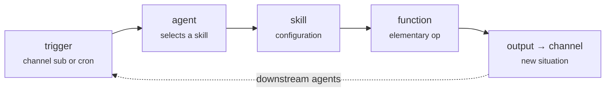

# Choreography & channels

Plasma has no central scheduler — no Airflow, no Dagster, no orchestrator deciding what runs when. Instead, every unit of behavior is an **agent** that listens to a **channel** and acts. Coordination is an emergent property of how channels connect, not something a coordinator imposes.

This is **choreography**, not orchestration: behavior emerges from channel topology. Change the wiring and you change the behavior — without touching the logic.

## The grammar of action

Every action in Plasma follows the same chain, from perception to effect:



The output of one action is just another channel — a new **situation** that downstream agents may be listening for. Actions compose by publishing, not by calling each other.

## The agent

An agent is the orchestration unit of the event-driven side ([Function → Skill → Agent](component-model.md)). Three properties make choreography work:

- **An agent holds a *repertoire* of skills**, not one. Which skill fires is decided by the incoming situation, not hard-wired.
- **An agent embeds its own trigger.** Either a **channel subscription** (reactive — fires on an event) or a **cron expression** (proactive — fires on a schedule). The trigger is part of the agent; there is no external scheduler to register with.
- **An agent is its own micro-orchestrator.** It subscribes, selects, and executes. Nothing above it sequences it.

Agents run on a runtime per layer — **Go** on Integration (NATS), **Scala Spark** on Cognition (Kafka) — but the pattern is identical.

## The channel *is* the situation

This is the idea that removes the need for a coordinator.

A channel's **name** encodes meaning. Subscribing to a channel resolves **both** *surveillance* (what to watch) **and** *situation* (what it means) at design time, through the naming convention. There is no separate runtime step that inspects an event and decides "what kind of situation is this?" — the channel already answered that.

!!! note "Skills are channel-agnostic"
    A skill has no awareness of where its output goes. Its output channel is handed to it by the agent's configuration. The same skill can feed completely different topologies depending on how it's wired — the skill and function are never touched.

## Channel routing: join vs divide

When several agents use the **same** skill, one configuration field decides whether their flows **converge** or **stay separate** — the output channel.

=== "Join — flows converge"

    Output to the skill's own channel (`skill.mrc`). Downstream sees one unified stream regardless of which agent triggered it.

    ```mermaid
    flowchart LR
      A1["agent-A"] --> SK["skill-X"]
      A2["agent-B"] --> SK
      SK --> CH["skill.channel"] --> D["downstream agent"]
    ```

=== "Divide — flows stay separate"

    Output to each agent's own channel, suffixed with the situation (`agent.mrc/situation`). Each flow stays isolated even though they share a skill.

    ```mermaid
    flowchart LR
      A1["agent-A"] --> SK1["skill-X"] --> C1["agent-A.channel/situation-A"] --> D1["downstream-A"]
      A2["agent-B"] --> SK2["skill-X"] --> C2["agent-B.channel/situation-B"] --> D2["downstream-B"]
    ```

| Output channel | Pattern | Effect |
|---|---|---|
| `skill.mrc` (skill channel) | shared | **join** — flows converge |
| `agent.mrc/situation` (agent channel + suffix) | isolated | **divide** — flows stay separate |

Channel assignment in the agent's configuration is the **only** place join-vs-divide is decided. Change one field, change the topology — the skill and function are untouched.

## Debugging agent flows

Because everything is channels, you debug by tracing the chain **backwards** from the symptom:

| Observation | Where to look |
|---|---|
| Agent never fires | Channel subscription — is it listening to the right channel? |
| Wrong agents fire | Channel is too broad — something is publishing to it unexpectedly |
| Right agent, wrong skill selected | The agent's selection logic |
| Right skill, bad output | Skill configuration or the Function |
| Output never reaches downstream | Output channel — join vs divide misconfigured |

---

Next: the platform-wide patterns that make this work at scale — [Core patterns](patterns.md). For authoring agents, see [Defining agents](../build/agents.md).
