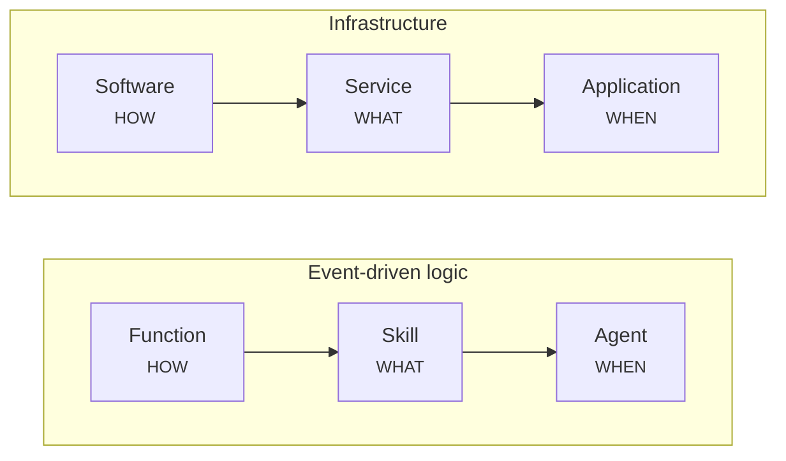

# Component model

Plasma is composed from a small set of building blocks. From smallest to largest: **components → packages → models → platforms**.

## Components

A **component** is a single-purpose, reusable unit living under `src/<layer>/<kind>/<name>/`. Every component carries metadata (author, description, license, version) and the tasks needed to build and configure it.

Components compose along **two parallel patterns**, both following **HOW → WHAT → WHEN** (computation → configuration → orchestration):

- **Event-driven logic:** **Function** (computation) → **Skill** (configuration) → **Agent** (orchestration)
- **Infrastructure:** **Software** (computation) → **Service** (configuration) → **Application** (orchestration)



The two triads are the same shape: a universal *how*, aimed by a *what*, run at the right *when*. An **agent** orchestrates skills exactly as an **application** orchestrates services.

A **function** is a universal computation; a **skill** configures it for a specific use; an **agent** decides *when* it runs. An agent embeds its own trigger — an event subscription (reactive) or a schedule (proactive) — and holds a repertoire of skills, selecting one from the incoming situation. Just as an **application** orchestrates services from a manifest, an **agent** orchestrates skills from its configuration.

Other component kinds include **entities** (data contracts), **libraries** (shared code), and **builders** (build logic).

## Packages

A **package** is a repository of related components for a domain. Packages are composed into platforms via a `compose.yaml`:

```yaml
name: plasma
dependencies:
  - name: plasma-core
    source:
      type: git
      ref: main
      url: https://github.com/plasmash/plasma-core.git
```

Planned packages include `plasma-core` (the kernel), `plasma-work`, `plasma-data`, `plasma-talk`, `plasma-code`, `plasma-learn`, and `plasma-lab`. They are being published progressively — see [github.com/plasmash](https://github.com/plasmash).

## Models

A **model** composes packages plus configuration into a complete, deployable platform blueprint. For example, **`ta` (The Agency)** is a digital operating system for service companies, composed from all the packages above.

## Platforms

A **platform** is a materialized model running on your infrastructure. The `plasmactl` workflow takes you there:

```
compose.yaml → model:compose → model:prepare → model:bundle → platform:up
   (packages)      (merge)        (ansible)      (artifact)    (deploy)
```

Continue to the [CLI reference](../cli/index.md) for the commands behind each step.
