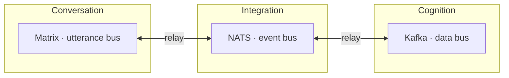
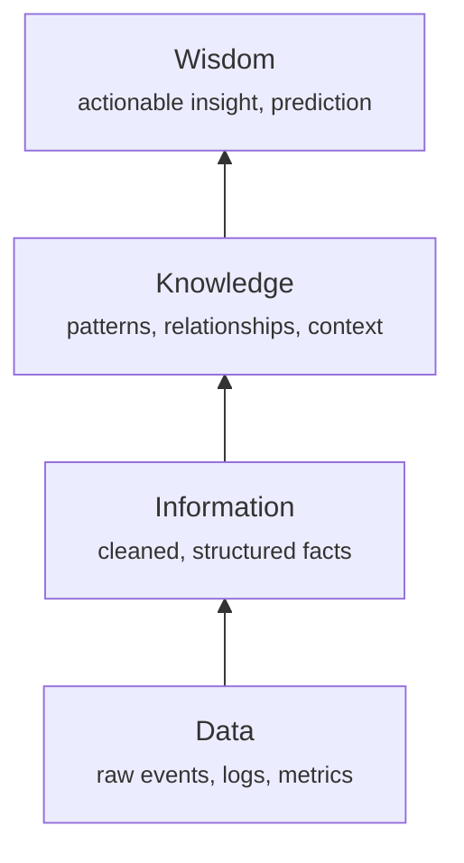

# Core patterns

A handful of patterns recur across every layer and make the platform coherent. Understand these five and the rest of Plasma reads as variations on them.

## ECST — Event-Carried State Transfer

Plasma's fundamental event-driven pattern: **events carry the complete state needed to process them.**

A consumer never queries back to the source system to "fill in" missing fields — everything it needs travels in the event. That single rule buys a lot:

- **Loose coupling** — producers and consumers don't depend on each other's availability or APIs.
- **Replayability** — an event is a self-contained fact; reprocessing it is deterministic.
- **Real-time throughput** — no synchronous round-trips on the hot path.

The Integration layer (NATS) is the event backbone that carries these business events.

## Bus per layer, relays between

Each layer has its **own** message bus, tuned to its semantics. Layers never share a bus, and they never reach into each other directly. The **only** cross-layer coupling point is a **relay** — a Benthos/Bento process that moves data between buses with backpressure, explicitly and observably.

| Layer | Bus | Technology | Carries |
|---|---|---|---|
| **Integration** | Event bus | NATS | Business events (ECST), entity changes, agent triggers — low latency |
| **Cognition** | Data bus | Kafka | High-throughput analytics streams — durable, exactly-once |
| **Conversation** | Utterance bus | Matrix / Synapse | Chat, email, calls — federated, end-to-end encrypted |

!!! note "Emerging buses"
    Foundation, Interaction, and Stabilization are gaining their own buses as those layers mature. The principle holds regardless: **one bus per layer, relays between.**

Don't route business events through Kafka or analytics through NATS — each bus serves its layer's semantics. Cross-layer data flows through relays only.

## DIKW — the analytics hierarchy

The Cognition layer climbs the classic wisdom pyramid, turning raw events into action:

| Stage | What it is | Where it happens |
|---|---|---|
| **Data** | Raw events, logs, metrics | Kafka / NATS streams |
| **Information** | Cleaned, structured facts | Spark processing |
| **Knowledge** | Patterns, relationships, context | Druid aggregations |
| **Wisdom** | Actionable insight, prediction | AI/ML models |

## Ontology as data contract

Entities and Metrics together form the **stable contract** between systems — the API that lets producers and consumers evolve independently.

- **Entities** define *what exists* — Person, Project, Utterance.
- **Metrics** define *how to measure* — Engagement, Sentiment, Risk.
- The contract is a **Protobuf** schema (`files/*.proto`), chosen for backward/forward-compatible evolution.
- A change to the ontology is a **breaking change** — it requires migration planning, exactly because so much depends on the contract.

Because the ontology is explicit and versioned, any layer can produce or consume an entity without coordinating with the others — they only have to agree on the schema.

## Integration concurrency

The Integration layer is where concurrent entity mutations meet, so it manages them carefully:

- **Critical sections** — per-entity-ID locks prevent concurrent writes to the same entity.
- **Latency-based reordering** — events with older timestamps are processed first, compensating for network jitter.
- **Revision / changelog tracking** — every mutation increments a revision; a "no change" detection prevents redundant work.
- **Event-origin tracking** — events carry origin metadata so a change doesn't loop back to its own source.

!!! warning "The classic infinite-loop bug"
    The most common failure here is a **missing "no change" exit** from a critical section: an entity writes an event, the event triggers reprocessing, reprocessing writes the *identical* state, which emits another event — forever. Always exit the critical section when nothing changed.

---

Next: [Topology & nodes](topology.md) — how the logical platform maps onto physical machines.
