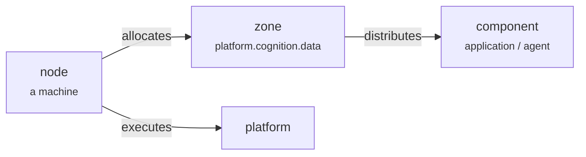

# Topology & nodes

The **topology** is the platform's structural skeleton — it maps the logical architecture onto physical machines. It's not a layer or a service; it's the wiring that says *which components run where*.

## Zones — the units of the topology

A **zone** is a named section of the platform, like `platform.cognition.data` or `platform.foundation.storage.kv`. Components are placed into zones, and machines are assigned to zones. The topology is simply the arrangement of all the zones. (Zones are the entity; "topology" is the structure they form — managed with [`plasmactl zone`](../cli/zone.md).)

## Two edges wire logical to physical

The whole mapping comes down to a few directed relationships:

- **`distributes`** — a zone delivers a set of components (applications, agents) onto wherever it lives.
- **`allocates`** — a node serves one or more zones.
- **`executes`** — a node runs the platform instance.

Change a node's zone assignment and the components follow — no component is hard-wired to a machine.

## Compute profiles

Zones carry *intent* about the compute they need, so each component lands on appropriate hardware:

| Zone | Wants |
|---|---|
| `platform.cognition.data` | GPU-enabled nodes (AI/analytics) |
| `platform.foundation.storage.kv` | storage-optimized nodes |
| `platform.interaction.observability` | balanced compute nodes |

## Nodes

A **node** is a physical or virtual machine. Each node declares which zones it serves; the topology distributes the right components onto it. Nodes are the single source of truth for per-machine state (zones, network, disks) — see [Nodes & topology](../operate/nodes.md) for the operational side.

!!! note "Biological analogy"
    Topology is the **skeleton**; nodes are **bones** with different properties (some dense for storage, some powerful for compute). The skeleton gives the organism its shape and decides where each organ sits.
