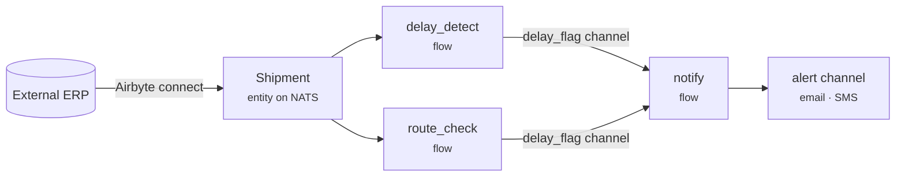
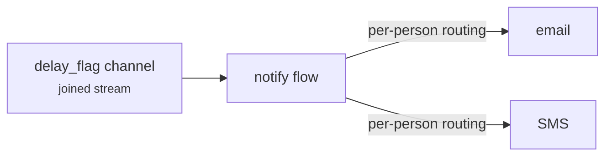

# Ingest & react

**Scenario:** shipment updates live in an external ERP. We want Plasma to pull them in, notice when a shipment is running late, and page the right people — all in real time, with no polling and no central orchestrator.

This example strings together four Plasma patterns: a **connector** to ingest, an **entity** as the contract, a **choreography** of agents to react, and **alerting** to notify.



## 1. Ingest with a connector

The [`connect`](../integrate/patterns.md#connectors) application (Airbyte) pulls records from the ERP on a schedule and lands them on the integration bus using the custom Plasma destination — no bespoke ingestion code. You point it at the source and map records to the `Shipment` entity.

```yaml title="compose.yaml"
name: logistics-demo
dependencies:
  - name: plasma-core
    source: { type: git, ref: main, url: https://github.com/plasmash/plasma-core.git }
```

## 2. The contract

Every downstream agent depends on the same typed shape — the [entity](../build/schemas.md) is the contract:

```proto title="src/integration/entities/shipment/files/shipment.proto"
syntax = "proto3";
package machine.shipment;

message Shipment {
  string id          = 1 [(is_primary_key)=true];
  string status      = 2;   // in_transit | delivered | ...
  int64  eta         = 3;
  int64  promised_by = 4;
}
```

## 3. React with a choreography

A `shipments` **agent** manages two **flows** — each an inline spec reacting to the same `Shipment` channel, watching for a different problem. Neither flow knows about the other; they simply react to the same situation:

```jinja title="src/integration/agents/shipments/templates/manifests.yaml.j2"
---
kind: Flow
name: delay_detect
trigger: "data:{{ integration__skills__shipment_registrar.mrc }}.event"
output: {{ integration__skills__delay_flag.mrc }}
skill: integration.skills.eta_slipped         # flags eta > promised_by
---
kind: Flow
name: route_check
trigger: "data:{{ integration__skills__shipment_registrar.mrc }}.event"
output: {{ integration__skills__delay_flag.mrc }}
skill: integration.skills.route_deviation
```

Because both flows emit onto the **same `delay_flag` channel**, their outputs **join** into one stream that a single notifier consumes — instead of two parallel streams. That output field is the whole topology decision; see [join vs divide](../concepts/choreography.md#channel-routing-join-vs-divide).

## 4. Notify

A `notify` flow triggers on the joined `delay_flag` channel and dispatches through the [alert machine](../operate/observability.md#alerting), which routes per person over email or SMS:



## Why this shape

- **No orchestrator** — adding a third detector is a new flow reacting to the same channel; nothing else changes. Behaviour emerges from what listens to what.
- **The contract decouples everyone** — the ERP connector, the detectors, and the notifier only agree on the `Shipment` proto.
- **Ingestion is configuration, not code** — the connector is declared, not written.

→ Build the pieces: [Defining agents](../build/agents.md) · [Entity schemas](../build/schemas.md) · [Integration patterns](../integrate/patterns.md).
