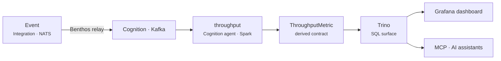
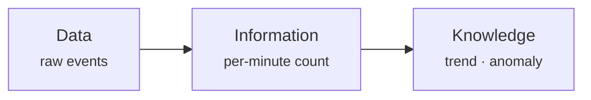

# Streaming analytics

**Scenario:** a high-volume stream of raw events (say, request logs or device pings) arrives faster than anyone wants to eyeball. We want a **live metric** — throughput per minute — computed continuously and queryable like a table.

This example crosses layers: raw events live on the **Integration** bus, but heavy stream processing belongs in **Cognition**. A relay moves data between them with backpressure, and the result is a first-class **metric** in the ontology.



## 1. Move data to where compute lives

Raw events flow on NATS, but windowed aggregation over a firehose is a Cognition job (Scala Spark on Kafka). A [Benthos relay](../integrate/patterns.md#connectors) bridges the two buses and provides **backpressure**, so a spike in events can't overwhelm the analytics job.

This is the [layered architecture](../concepts/architecture.md) doing its job: each layer keeps its own bus, and relays are the only crossings.

## 2. Compute the metric

The aggregation is a **function** (the *how*), a **skill** configures a one-minute window (the *what*), and a **Cognition agent** manages the **flow** that runs it continuously (the *when*) — the same [Function → Skill → Agent](../concepts/component-model.md) triad you already know, on the Cognition runtime:

```yaml title="src/cognition/agents/metrics/meta/plasma.yaml"
plasma:
  author: You
  categories: [machine, kind.agent]
  description: The metrics-related flows manager
  license: EUPL-1.2
  version: c0f288cc460e2
```

```jinja title="src/cognition/agents/metrics/templates/manifests.yaml.j2"
---
kind: Flow
name: per_minute_throughput
trigger: "data:{{ integration__skills__event_registrar.mrc }}.event"   # consumes the event stream
output: {{ cognition__skills__per_minute_count.mrc }}
skill: cognition.skills.per_minute_count
```

The aggregation logic itself lives in the function (Scala/Spark); the flow just decides it runs on every window of the stream.

## 3. A metric is a contract

The output isn't a throwaway number — it's a **metric**, part of the [ontology](../concepts/patterns.md#ontology-as-data-contract) alongside entities. This is the **DIKW** ladder in practice: raw **Data** (events) becomes **Information** (a per-minute count) becomes **Knowledge** (a trend you can alert on).



## 4. Query it anywhere

Because the metric is a typed contract, [Trino](../integrate/patterns.md#unified-query) exposes it as SQL across the whole platform — no bespoke API. From there it surfaces on a [Grafana dashboard](../operate/observability.md) and, through the [MCP server](../integrate/mcp.md), to AI assistants that can ask about it in natural language.

## Why this shape

- **Right layer for the job** — transactional events stay on Integration; stream crunching happens in Cognition. Relays keep the boundary explicit.
- **Backpressure, not backlog** — the relay protects the analytics job from event spikes.
- **One query surface** — the derived metric is queryable like any other data, by dashboards, scripts, or AI.

→ Related: [Architecture & layers](../concepts/architecture.md) · [Core patterns (DIKW, ontology)](../concepts/patterns.md) · [Integration patterns](../integrate/patterns.md).
