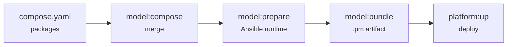

# Platform lifecycle

A platform goes from a declaration of packages to running infrastructure through four steps. `platform:up` runs them for you, but it's worth knowing what each does.



## 1. Compose

```sh
plasmactl model:compose
```

Reads `compose.yaml`, fetches each package from its git source, and **merges** them into a single composed model. Packages are developed in separate repos and brought together here.

## 2. Prepare

```sh
plasmactl model:prepare
```

Turns the composed model into a runnable **Ansible runtime**.

## 3. Bundle

```sh
plasmactl model:bundle
```

Produces a deployable **Platform Model** artifact (`.pm`) — a self-contained, versioned snapshot of everything the platform needs.

## 4. Up

```sh
plasmactl platform:up
```

Runs the full pipeline — **bump → compose → prepare → deploy** — bringing the platform up on your infrastructure. In practice you deploy against a **zone target** for correct variable resolution (see [Deploying](deploying.md)).

!!! note "Composability"
    Packages live in their own repositories, are declared in a platform's `compose.yaml`, and are composed and deployed together. This is what lets a platform mix `plasma-core` with domain packages and your own.

→ Next: [Nodes & topology](nodes.md).
