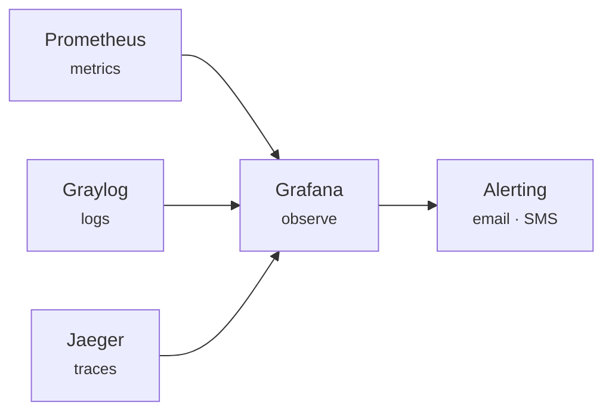

# Observability

The Foundation layer is Plasma's **observability hub**: it collects metrics, logs, and traces from every layer, each of which publishes over its own bus. You get a full-stack view without wiring up a separate monitoring stack.

## Signals

The three signal types are each backed by a dedicated, industry-standard stack:

| Signal | Stack | What it captures |
|---|---|---|
| **Metrics** | **Prometheus** | time-series metrics scraped from every component and exporter |
| **Logs** | **Graylog** (with Elasticsearch, MongoDB, Fluentbit) | structured, searchable logs aggregated across all layers |
| **Traces** | **Jaeger** (with OpenTelemetry) | distributed traces following a request across services |

Because collection lives in Foundation, adding a component to any layer makes its signals visible automatically — there is no per-layer monitoring to stand up.

## Dashboards

Metrics and logs surface through **Grafana**, deployed as the **`observe`** application (alongside an Alloy collector and its own datastore). Dashboards ship with the platform and can be extended per deployment.

## Alerting

Alerts are driven by Prometheus rules and dispatched by the platform's **alert machine**, which routes each alert to the right people over the right channel:

- **Channels** — **email** and **SMS**.
- **Per-person routing** — an alert declares who to notify and how, so a rule can page one on-call person by SMS while emailing a wider group. Routing is annotation-driven on the alert itself.

!!! note "What counts as a signal"
    Alerting reacts to **metrics** thresholds. For after-the-fact investigation of what happened and why, reach for logs (Graylog) and traces (Jaeger) — see [Investigating a platform](investigating.md).

→ Related: [Security](security.md) for the access side of operations, and [Debugging](debugging.md) for turning signals into fixes.
