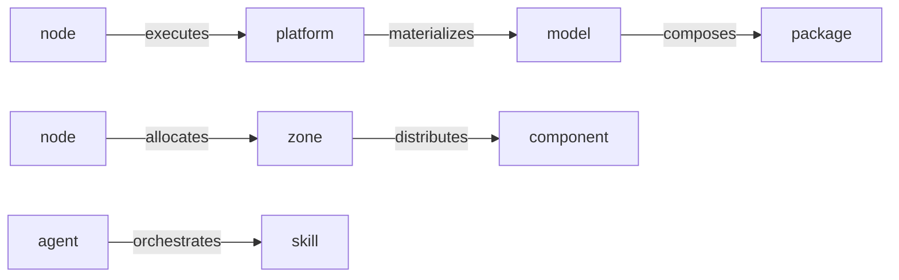

# Dependency graph

Every Plasma platform *is* a typed, directed graph. A single command — [`platform:graph`](../operate/investigating.md) — builds it, and most of `plasmactl`'s understanding (validation, impact analysis) is graph queries underneath.

## Node types

| Node | What it is |
|---|---|
| `platform` | The running system |
| `model` | The blueprint composing packages |
| `package` | A bundle of components |
| `zone` | A unit of the topology |
| `node` | A physical/virtual machine |
| `component` | An application, agent, service, … |
| `variable` | A configuration value |

## Edge types

The edges are the meaning — they say how the pieces relate:



| Edge | From → To | Meaning |
|---|---|---|
| `executes` | node → platform | the machine runs the platform |
| `materializes` | platform → model | the platform realizes this model |
| `composes` | model → package | the model includes this package |
| `distributes` | zone → component | the zone delivers this component |
| `allocates` | node → zone | the machine serves this zone |
| `orchestrates` | agent → skill | the agent drives this skill |

## Working with it

```sh
plasmactl platform:graph --json        # the whole graph, programmatically
plasmactl platform:graph <node>        # one node + its dependencies
plasmactl platform:graph <node> --reverse   # what depends on it
plasmactl platform:impact <node>       # blast radius of changing it
```

The graph is computed by a dedicated `platform-graph` binary, so it's fast even on large platforms — query it freely from scripts and [automation](../integrate/automation.md).
