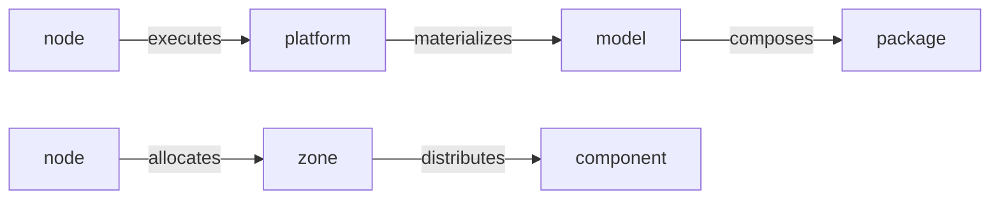

# Dependency graph

Every Plasma platform *is* a typed, directed graph. A single command — [`platform:graph`](../operate/investigating.md) — builds it (a Rust `platform-graph` binary walks the composed filesystem and parses the YAML/Jinja2), and most of `plasmactl`'s understanding (validation, impact analysis) is graph queries underneath. The node and edge types are aligned with the Plasma ontology.

## Node types

| Node | What it is | Example |
|---|---|---|
| `platform` | A running platform instance | `my-platform` |
| `model` | The composition blueprint | `my-model` |
| `package` | A component bundle | `plasma-core` |
| `zone` | A topology zone | `platform.interaction.observability` |
| `node` | A physical/virtual machine | `control-001` |
| `component` | Any component — see kinds below | `interaction.applications.dashboards` |
| `variable` | A configuration variable | `cluster_domain` |

A `component` node carries a **kind**:

`application` · `service` · `software` · `agent` · `skill` · `function` · `entity` · `metric` · `library` · `builder`

## Edge types

Edges are where the meaning lives — they're aligned with the ontology's columns (Execution, Materialization, Composition, Distribution, Orchestration, Configuration, Computation, Implementation, Definition, Choreography).

### Structural — the platform skeleton



| Edge | Direction | Meaning |
|---|---|---|
| `executes` | node → platform | the machine runs the platform instance |
| `materializes` | platform → model | the platform realizes this model |
| `composes` | model → package | the model includes this package |
| `contains` | package / model / platform / zone → child | the containment hierarchy |
| `distributes` | zone → component | the zone delivers this component onto infrastructure |
| `allocates` | node → zone | the machine serves this zone |

### Behavioral — the two triads & choreography

| Edge | Direction | Meaning |
|---|---|---|
| `orchestrates` | agent → skill, agent → agent | an agent drives a skill (or another agent) |
| `configures` | skill → function | a skill configures a function |
| `choreographs` | agent → agent | one agent's output triggers another via channels |

### Dependency — how components relate

| Edge | Direction | Meaning |
|---|---|---|
| `computes` | component → component | computation dependency |
| `implements` | component → component | implementation dependency |
| `depends` | component → component | generic dependency |
| `uses` | component → component | usage dependency |
| `builds` | component → component | build dependency |

### Variables

| Edge | Direction | Meaning |
|---|---|---|
| `defines` | component → variable | a component defines a variable |
| `overrides` | zone / platform → variable | a zone or platform overrides a variable |
| `parametrizes` | variable → component | a variable parametrizes a component |

## Working with it

```sh
plasmactl platform:graph --json        # the whole graph, programmatically
plasmactl platform:graph <node>        # one node + its dependencies
plasmactl platform:graph <node> --reverse   # what depends on it
plasmactl platform:graph --format mermaid    # a diagram
plasmactl platform:impact <node>       # blast radius of changing it
```

The graph is fast even on large platforms — query it freely from scripts and [automation](../integrate/automation.md).
