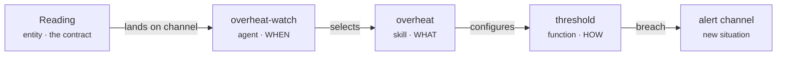

# Your first platform

This tutorial builds one capability end to end — from a data contract to a running, reactive agent — so you see how every piece of Plasma fits together. We'll build an **overheat watcher**: it ingests sensor readings and reacts the moment one crosses a temperature limit.

By the end you'll have touched all three sides of Plasma: an **entity** (the contract), the **Function → Skill → Agent** triad (the behaviour), and the **compose → up** pipeline (the deploy).

!!! note "What you need"
    A working `plasmactl` — see [Install](../install.md) — and somewhere to deploy (a Kubernetes target, or a local node registered with [`plasmactl node`](../cli/node.md)). The component conventions below come from [Build](../build/component-anatomy.md); this page strings them into one flow.

## What we're building



One **function** does the computation; a **skill** aims it at temperature; an **agent** fires it whenever a reading arrives. Swapping in a different limit — or a humidity check — is later just another skill, never a rewrite.

## 1. Scaffold the platform

Create a platform and declare which packages it composes from. `plasma-core` provides the runtimes and builders every component relies on:

```sh
plasmactl platform:create overheat-demo
cd overheat-demo
```

```yaml title="compose.yaml"
name: overheat-demo
dependencies:
  - name: plasma-core
    source:
      type: git
      ref: main
      url: https://github.com/plasmash/plasma-core.git
```

## 2. Define the entity (the contract)

Everything in Plasma exchanges typed data. Define a `Reading` as a Protobuf schema — the `.proto` **is** the contract, and it can evolve without breaking consumers:

```proto title="src/integration/entities/reading/files/reading.proto"
syntax = "proto3";
package machine.reading;

message Reading {
  string id        = 1 [(is_primary_key) = true];
  string sensor_id = 2;
  double celsius   = 3;
  int64  observed_at = 4;
}
```

Generate the JSON schemas Plasma validates against at build time:

```sh
plasmactl platform.entities:generate-schemas
```

## 3. Write the function (HOW)

A **function** is a generic, reusable computation. `threshold` compares a value against a limit — it knows nothing about temperature yet:

```yaml title="src/integration/functions/threshold/meta/plasma.yaml"
kind: function
metadata: { pcn: "integration.functions.threshold", pcsn: "threshold" }
name: "integration.functions.threshold"
description: "Reports whether a numeric value exceeds a limit"
parameters: [value, limit]
```

## 4. Configure a skill (WHAT)

A **skill** binds the function's parameters to concrete values for one use case — here, watching a reading's `celsius` against a safe ceiling:

```yaml title="src/integration/skills/overheat/meta/plasma.yaml"
kind: skill
metadata: { pcn: "integration.skills.overheat", pcsn: "overheat" }
name: "integration.skills.overheat"
description: "Flags a reading whose temperature exceeds the safe limit"
function: integration.functions.threshold
bindings:
  value: "{{ reading.celsius }}"
  limit: 80
```

## 5. Wire the agent (WHEN)

An **agent** decides *when* the skill runs. It embeds its own trigger — no external scheduler — and holds a repertoire of skills, choosing one from the incoming situation. Here it subscribes to the `Reading` channel and fires on every new reading:

```yaml title="src/integration/agents/overheat-watch/meta/plasma.yaml"
kind: agent
metadata: { pcn: "integration.agents.overheat-watch", pcsn: "overheat-watch" }
name: "integration.agents.overheat-watch"
description: "Watches sensor readings and reacts when one overheats"
trigger:
  channel: platform.integration.machine.reading   # reactive: fires on each new reading
skills:
  - integration.skills.overheat
output:
  channel: skill.mrc          # join — emit breaches onto the skill's channel
```

The `output.channel` is the one field that decides topology: routing to `skill.mrc` makes downstream consumers see a single joined stream; routing to `agent.mrc/situation` keeps parallel flows separate. See [join vs divide](../concepts/choreography.md#channel-routing-join-vs-divide).

## 6. Version your components

A component's version **is** its git commit hash. `component:bump` stamps it and cascades the bump through the dependency tree (function → skill → agent):

```sh
git add -A && git commit -m "feat: overheat watcher"
plasmactl component:bump
plasmactl component:sync
```

## 7. Bring the platform up

Deploy against a [zone target](../operate/nodes.md) so variables resolve correctly. `platform:up` runs the whole pipeline — bump → compose → prepare → deploy:

```sh
plasmactl platform:up dev overheat-demo
```

Confirm what landed — never read files by hand, query the graph:

```sh
plasmactl platform:graph
```

## What happens at runtime

Once up, the loop runs with no central coordinator:

1. A sensor publishes a `Reading` onto the integration bus (NATS).
2. `overheat-watch` is subscribed to that channel, so it wakes for each reading.
3. It selects the `overheat` skill, which runs `threshold` with `limit: 80`.
4. On a breach, it emits a new event onto the alert channel — which another agent can react to, and so on.

That last step is [choreography](../concepts/choreography.md): behaviour emerges from what listens to what, not from an orchestrator calling steps.

## Where to go next

- Add a second skill (say a `humidity` check) to the same agent — the function stays untouched. → [Defining agents](../build/agents.md)
- Route the breach to a dashboard or an [alert channel](../operate/observability.md).
- Understand the model you just used end to end → [Concepts](../concepts/index.md).
