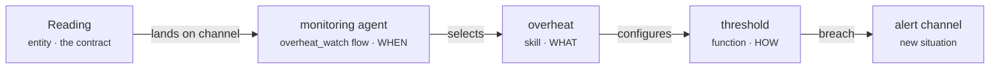

# Your first platform

This tutorial builds one capability end to end — from a data contract to a running, reactive agent — so you see how every piece of Plasma fits together. We'll build an **overheat watcher**: it ingests sensor readings and reacts the moment one crosses a temperature limit.

By the end you'll have touched all three sides of Plasma: an **entity** (the contract), the **Function → Skill → Agent** triad (the behaviour), and the **compose → up** pipeline (the deploy).

!!! note "What you need"
    A working `plasmactl` — see [Install](../install.md) — and somewhere to deploy (a Kubernetes target, or a local node registered with [`plasmactl node`](../cli/node.md)). The component conventions below come from [Build](../build/component-anatomy.md); this page strings them into one flow.

## What we're building



One **function** does the computation; a **skill** aims it at temperature; an **agent** fires it whenever a reading arrives. Swapping in a different limit — or a humidity check — is later just another skill, never a rewrite.

## 1. Scaffold the platform

Create a platform and declare which packages it composes from. `plasma-core` provides the runtimes and builders every component relies on:

```sh
plasmactl platform:create overheat-demo
cd overheat-demo
```

```yaml title="compose.yaml"
name: overheat-demo
dependencies:
  - name: plasma-core
    source:
      type: git
      ref: main
      url: https://github.com/plasmash/plasma-core.git
```

## 2. Define the entity (the contract)

Everything in Plasma exchanges typed data. Define a `Reading` as a Protobuf schema — the `.proto` **is** the contract, and it can evolve without breaking consumers:

```proto title="src/integration/entities/reading/files/reading.proto"
syntax = "proto3";
package machine.reading;

message Reading {
  string id        = 1 [(is_primary_key)=true];
  string sensor_id = 2;
  double celsius   = 3;
  int64  observed_at = 4;
}
```

Generate the JSON schemas Plasma validates against at build time:

```sh
plasmactl platform.entities:generate-schemas
```

## 3. Write the function (HOW)

A **function** is a generic, reusable computation. `threshold` compares a value against a limit — it knows nothing about temperature yet. Every component is identified by its `meta/plasma.yaml`, its kind carried in `categories`:

```yaml title="src/integration/functions/threshold/meta/plasma.yaml"
plasma:
  author: You
  categories: [machine, kind.function]
  description: Reports whether a value exceeds a limit
  license: EUPL-1.2
  version: 4fc38a21d392f    # set by plasmactl component:bump
```

The computation itself lives in `files/` as code — Go for the Integration layer.

## 4. Configure a skill (WHAT)

A **skill** configures the function for one use case — here, watching a reading's `celsius` against a safe ceiling. It carries prefixed default variables and a config template the function reads at runtime:

```yaml title="src/integration/skills/overheat/meta/plasma.yaml"
plasma:
  author: You
  categories: [machine, kind.skill]
  description: Flags a reading whose temperature exceeds the safe limit
  license: EUPL-1.2
  version: eed584e7b4fc3
```

```yaml title="src/integration/skills/overheat/defaults/main.yaml"
overheat_limit_celsius: 80
```

```jinja title="src/integration/skills/overheat/templates/config.yaml.j2"
threshold:
  value: "{{ reading.celsius }}"
  limit: {{ overheat_limit_celsius }}
```

## 5. Wire the agent (WHEN)

An **agent** decides *when* the skill runs. It manages **flows** — inline specs in its `manifests.yaml.j2`, each binding a trigger to a skill and an output channel. No external scheduler: the flow reacts to the channel where readings are published (`data:…event`).

```yaml title="src/integration/agents/monitoring/meta/plasma.yaml"
plasma:
  author: You
  categories: [machine, kind.agent]
  description: The monitoring-related flows manager
  license: EUPL-1.2
  version: f659b631a9df9
```

```jinja title="src/integration/agents/monitoring/templates/manifests.yaml.j2"
---
kind: Flow
name: overheat_watch
trigger: "data:{{ integration__skills__reading_registrar.mrc }}.event"   # fires on each new reading
output: {{ integration__skills__overheat.mrc }}
skill: integration.skills.overheat
```

The `output` channel is the one field that decides topology — where several flows converge or stay separate. See [join vs divide](../concepts/choreography.md#channel-routing-join-vs-divide). (The `reading_registrar` skill is the one that publishes `Reading` events onto the bus.)

## 6. Version your components

A component's version **is** its git commit hash. `component:bump` stamps it and cascades the bump through the dependency tree (function → skill → agent):

```sh
git add -A && git commit -m "feat: overheat watcher"
plasmactl component:bump
plasmactl component:sync
```

## 7. Bring the platform up

Deploy against a [zone target](../operate/nodes.md) so variables resolve correctly. `platform:up` runs the whole pipeline — bump → compose → prepare → deploy:

```sh
plasmactl platform:up dev overheat-demo
```

Confirm what landed — never read files by hand, query the graph:

```sh
plasmactl platform:graph
```

## What happens at runtime

Once up, the loop runs with no central coordinator:

1. A sensor publishes a `Reading` onto the integration bus (NATS).
2. The `overheat_watch` flow is triggered on that channel, so it fires for each reading.
3. It runs the `overheat` skill, which configures `threshold` with `limit: 80`.
4. On a breach, it emits onto the `overheat` skill's channel — which another agent's flow can react to, and so on.

That last step is [choreography](../concepts/choreography.md): behaviour emerges from what listens to what, not from an orchestrator calling steps.

## Where to go next

- Add a second skill (say a `humidity` check) to the same agent — the function stays untouched. → [Defining agents](../build/agents.md)
- Route the breach to a dashboard or an [alert channel](../operate/observability.md).
- Understand the model you just used end to end → [Concepts](../concepts/index.md).
